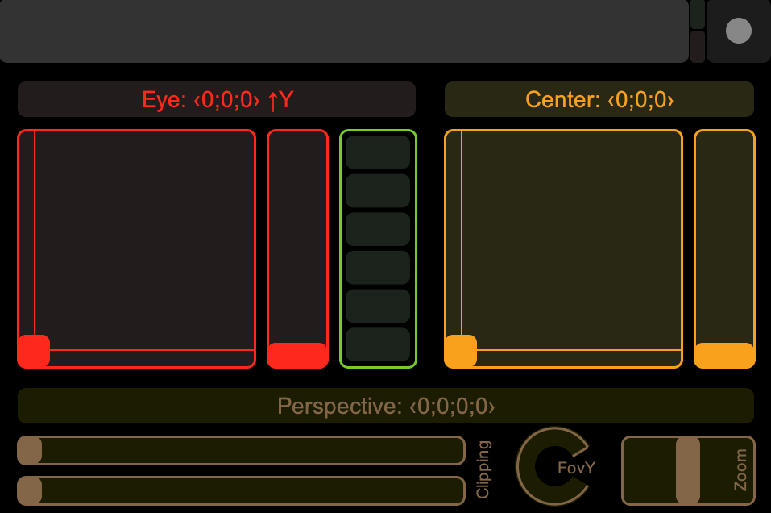
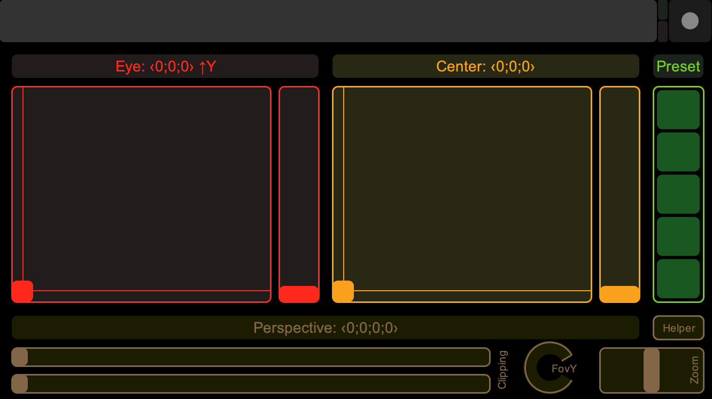

# TouchOSC Layouts

Layouts for [TouchOSC](http://hexler.net/software/touchosc) mobile app,
created with [TouchOSC Editor](http://hexler.net/docs/touchosc-editor-basics).

## P5Camera

A layout to drive the parameters of the [camera()](https://processing.org/reference/camera_.html)
and [perspective()](https://processing.org/reference/perspective_.html) Processing functions. Works as well to drive a [PerspectiveCamera](https://threejs.org/docs/index.html#api/en/cameras/PerspectiveCamera) of THREE.js.

 

[P5 Camera layout for iPhone/iPod Touch](iphone/P5Camera.touchosc) (480x320px) 
[P5 Camera layout for iPhone 6](iphone6/P5Camera.touchosc) (667x375px)

## License

 TouchOSC Layouts de <a xmlns:cc="http://creativecommons.org/ns#" href="https://github.com/olange" property="cc:attributionName" rel="cc:attributionURL">Olivier Lange</a> est mis à disposition selon les termes de la <a rel="license" href="http://creativecommons.org/licenses/by-sa/4.0/">licence Creative Commons Attribution -  Partage dans les Mêmes Conditions 4.0 International</a>.
